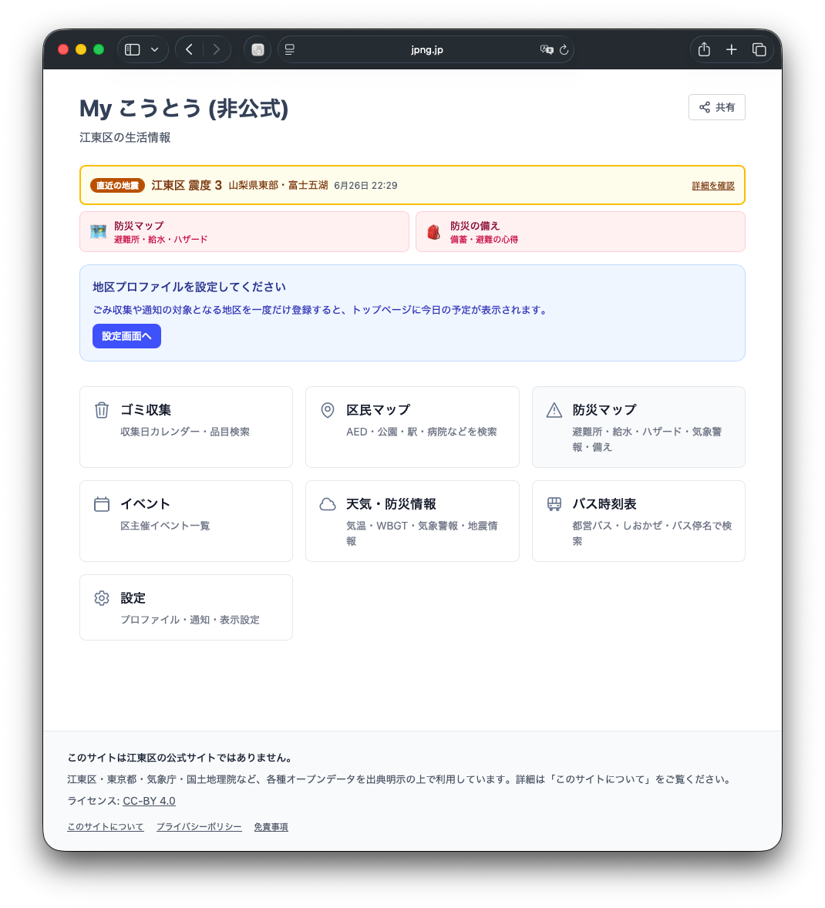
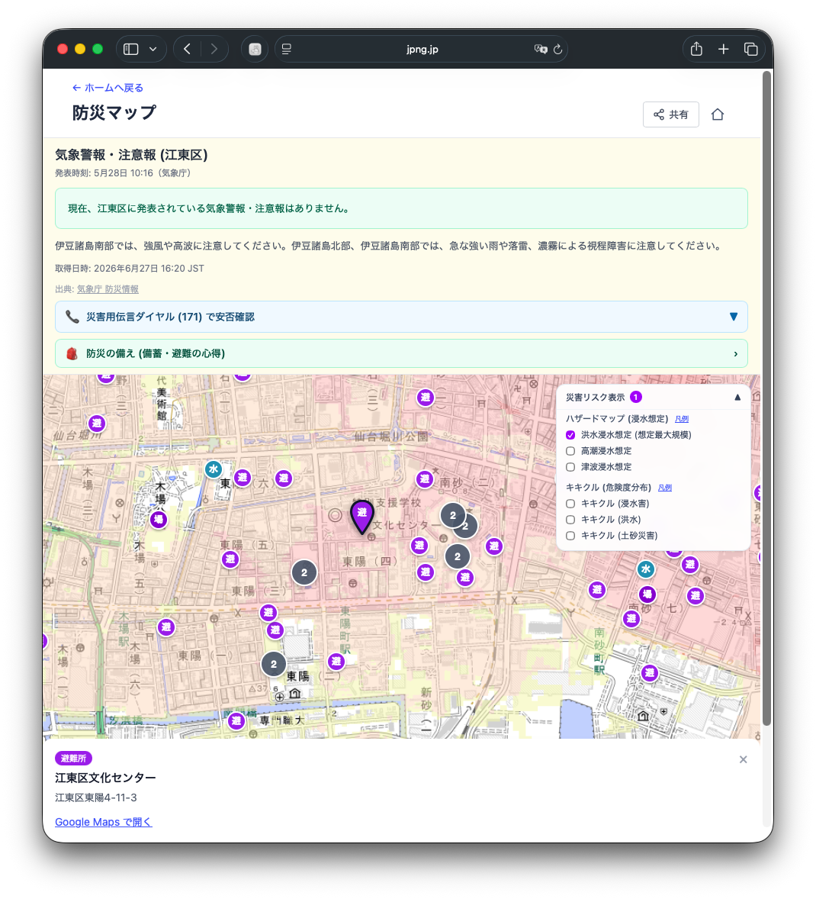
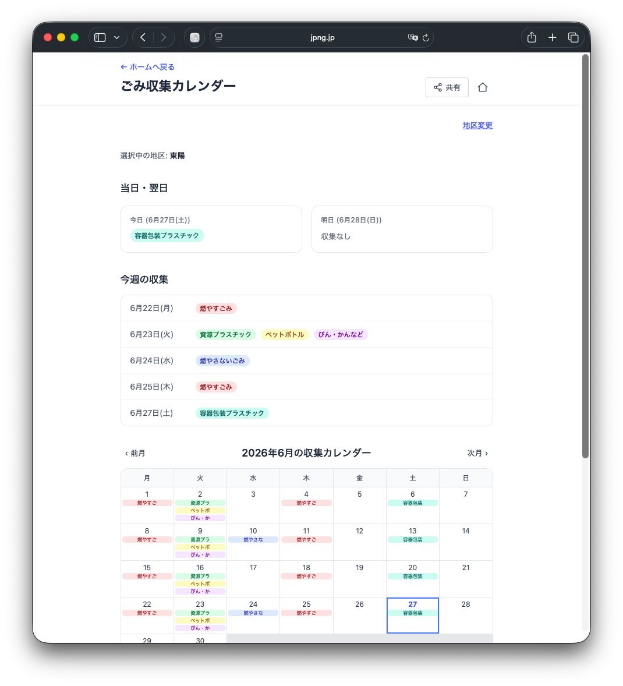
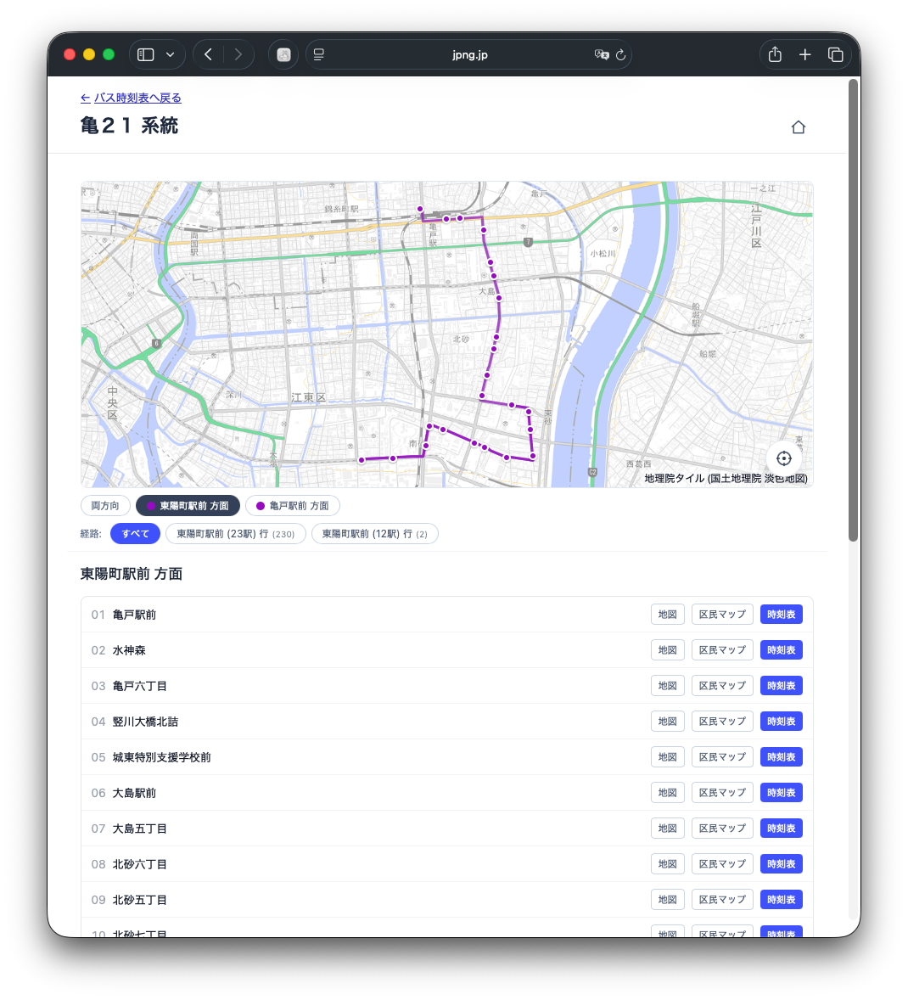
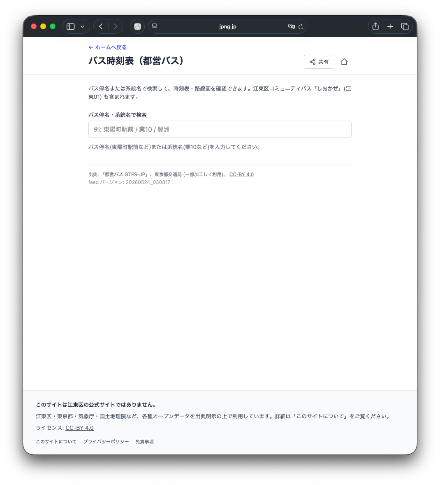

# My こうとう (非公式)

**このサービスは江東区の公式サイトではありません。**

江東区民が日常的に使う行政情報（ゴミ収集、AED、公衆トイレ、区主催イベント、天気、
気象警報・地震、都営バス時刻表など）を一画面に集約した非公式 PWA です。
江東区・東京都・各データ提供元は本サービスとは無関係です。

## スクリーンショット

| ホーム | 防災マップ |
|---|---|
|  |  |
| **区民マップ** | **ごみ収集カレンダー** |
|  |  |
| **バス時刻表 (路線図)** | **バス時刻表 (検索)** |
|  |  |

## 主な機能

- **ホームバナー (気象警報・地震)** — JMA bosai フィードから江東区に発表中の警報
  / 特別警報、および直近 24h で江東区が震度 2 以上を観測した地震をホーム上部に
  バナー表示。クリックで `/weather` の詳細パネルへ
- **防災への近道 (ホーム常設導線)** — 公式 [江東区防災ポータル](https://bosai.city.koto.lg.jp/)
  の「緊急情報を最優先」の情報設計に倣い、ホームのバナー直下に防災マップ・防災の備え
  への常設クイックリンクを配置。平常時から防災導線を 1 タップ圏内に保つ
- **ゴミ収集カレンダー** — 公式 CSV (CC-BY 4.0) を取り込んだ 58 区分の収集ルートに対応。
  地区検索、月次/週次/当日・翌日ビュー、`webcal://` 購読 (UA 判定で iOS は webcal、他は https)
- **ゴミ品目検索** — wanakana を使った NFKC + ひら↔カナ + ローマ字 双方向の正規化検索。
  「ペットボトル」「ぺっとぼとる」「PET」「ﾍﾟｯﾄﾎﾞﾄﾙ」が同一結果
- **区民マップ (14 レイヤ + 検索)** — AED (246) / 公衆トイレ (191) / 公園 (171) /
  図書館 (12) / 児童館 (18) / 区立保育園 (43) は江東区公式、避難所 (193) /
  避難場所 (12, 8 種ハザード対応フラグ付) / 給水拠点 (6) は東京都公式。
  追加で OSM-only レイヤ: 駅・地下鉄出入口 (transit カテゴリ)、病院・診療所・薬局
  (medical カテゴリ)。レイヤ抽象 (`lib/map/registry.ts`) で同一の toggle UI /
  マーカー描画 / OSM Overpass フォールバックを共有し、`bundled` フラグで
  Koto-bbox dedupe を制御。レイヤパネルに POI 名・住所の部分一致検索と
  件数バッジを実装。低ズーム時はピクセルグリッドで自動クラスタリング
- **バス時刻表** — 都営バス GTFS-JP (CC-BY 4.0) から江東区を通る 68 系統 ×
  1,510 停留所 (停留所名ベース 678) を libsql スナップショットに取込。停留所名で部分一致検索 →
  通る系統の方向別時刻表へ展開。江東区コミュニティバス「しおかぜ」(江東01) は
  同梱データに含まれており、ルートエイリアスで識別。アクティブ
  プロファイルの district label (丁目除去後) で初期検索値をプリセット
- **イベントカレンダー + ICS + 検索** — `ical-generator` + `@touch4it/ical-timezones`
  で VTIMEZONE 同梱、`STATUS:CANCELLED`、全テキストフィールドのエスケープ、
  URL は https only。タイトル / 場所 / 主催 / 説明にまたがる検索フィルタを実装
- **天気** — Open-Meteo を Edge proxy で取得、Vercel KV に stale-if-error キャッシュ、
  60 req/min/IP のレート制限、SSRF ハードニング (GET 限定 / redirect:'manual' / Zod 検証 /
  ヘッダ strip)
- **気象警報・注意報 (江東区)** — JMA `bosai/warning/data/warning/130000.json` を
  Edge proxy で取得、`areaTypes[1]` から江東区 (class20s 1310800) のみ抽出、
  警報コードを日本語ラベル + tier (特別警報 / 警報 / 気象情報 / 注意報) に解決。
  KV TTL=60s、stale-if-error 1h
- **地震情報 (江東区震度ハイライト)** — JMA `bosai/quake/data/list.json` の最新 10 件を
  Edge proxy で正規化、江東区 (city.code 1310800) で観測された震度をイベントごとに
  突合せ。KV TTL=5min、stale-if-error 24h
- **防災の備えガイド `/disaster/guide`** — 非常持ち出し品・備蓄チェックリスト
  (localStorage で進捗保持)、ハザード別の行動 (地震 / 水害 / 台風)、避難の心得
  (避難所と避難場所の違い・警戒レベル・垂直避難・マイ・タイムライン)、公式防災
  ページへのリンク集を 1 ページに集約。`/disaster` から導線。配信データなしの静的
  ガイドで、公式 [江東区防災ポータル](https://bosai.city.koto.lg.jp/) の「平常時の備え」からの学び
- **災害用伝言ダイヤル (171) 導線** — `/disaster` に 171 / web171 への導線カードを
  配置。`tel:171` リンク・web171 への外部リンク・録音/再生の 4 ステップ手順を折り
  たたみで表示。配信データなしの静的ガイド。公式 [江東区防災ポータル](https://bosai.city.koto.lg.jp/) の安否確認導線からの学び
- **災害リスクタイル重畳 (キキクル + ハザードマップ)** — `/disaster`・`/map` の
  地図に災害予測ラスタータイルをトグルで重畳。**キキクル** (気象庁 危険度分布) は
  浸水害 / 洪水 / 土砂災害の 3 面を `bosai/jmatile/data/risk` から取得 (basetime は
  `targetTimes.json` の `member:"none"` フレームで解決)。**ハザードマップ** (国土交通省
  「重ねるハザードマップ」) は洪水 (L2 想定最大規模) / 高潮 / 津波の浸水想定区域を
  `disaportaldata.gsi.go.jp/raster` から取得。両者とも CORS `*` のためクライアント直
  アクセス (Edge proxy なし)。レイヤ追加機構は `lib/map/use-raster-overlays.ts` に
  共通化し `/disaster`・`/map` で共有。ゼロメートル地帯の江東区で「自宅・避難先が
  浸水想定区域か」を一画面で確認できることを狙った、公式 [江東区防災ポータル](https://bosai.city.koto.lg.jp/) からの学び
- **WBGT (暑さ指数)** — 環境省 熱中症予防情報サイトの予測 CSV (東京観測所 44132)
  を Edge proxy で取得・パース。注意 / 警戒 / 厳重警戒 / 危険のバンドで色分けし
  6 時点先まで `/weather` に表示。30 分 KV キャッシュ + stale-if-error
- **PWA** — Service Worker (build ID 付き cache name)、機内モードで `/offline`、
  Vercel preview では manifest を 404 にして本番との混同を防止
- **プッシュ通知 (Web Push)** — 翌日のごみ収集を前日の指定時刻 (JST 18-22 時)
  に通知。設定画面でオプトイン制。VAPID 鍵で署名、購読情報は Vercel KV に
  保存。配信は GitHub Actions cron (`.github/workflows/push-dispatch.yml`)
  から `/api/push/dispatch` を叩く方式 (Vercel Hobby は cron が日次までのため)
- **CSP** — 本番は `script-src 'self' 'nonce-XXX' 'strict-dynamic'` (unsafe-eval/inline なし)。
  middleware で nonce を生成 (`crypto.getRandomValues`、128bit Base64URL)。
  HSTS / COOP / CORP / Permissions-Policy 全て付与。`report-to` + `report-uri`
  で違反を `/api/csp-report` に集約 (URL クエリ削除・UA はブラウザ名のみに正規化、
  Vercel KV LIST 直近 50 件保持)
- **観測性ダッシュボード `/status`** — 各データセットの最終更新時刻 (mtime)、
  Push 配信 cron の直近実行サマリ (試行/成功/失効/失敗の件数)、CSP
  違反レポートの直近 50 件を 1 ページに集約。運用者向け、ユーザ向けナビ非掲載

## データソース・ライセンス

| データ | 提供元 | ライセンス |
|--------|--------|-----------|
| ゴミ収集・AED・公衆トイレ・イベント | 東京都・江東区 ([東京都オープンデータカタログ](https://catalog.data.metro.tokyo.lg.jp/dataset?organization=t131083)) | [CC-BY 4.0](https://creativecommons.org/licenses/by/4.0/deed.ja) |
| 避難所・避難場所 | 東京都総務局 ([東京都防災マップ 避難所・避難場所一覧](https://catalog.data.metro.tokyo.lg.jp/dataset/t000003d0000000093)) | [CC-BY 4.0](https://creativecommons.org/licenses/by/4.0/deed.ja) |
| 給水拠点 | 東京都水道局 ([給水拠点一覧](https://catalog.data.metro.tokyo.lg.jp/dataset/t000019d0000000001)) | [CC-BY 4.0](https://creativecommons.org/licenses/by/4.0/deed.ja) |
| 23 区内マップレイヤ補完データ (駅・出入口・病院・診療所・薬局を含む) | [OpenStreetMap contributors](https://www.openstreetmap.org/copyright) | ODbL |
| 都営バス GTFS-JP (江東01「しおかぜ」を含む) | 東京都交通局 ([ODPT 経由](https://ckan.odpt.org/dataset/b_bus_gtfs_jp-toei)) | [CC-BY 4.0](https://creativecommons.org/licenses/by/4.0/deed.ja) |
| 気象警報・注意報 / 震源・震度情報 / キキクル (危険度分布タイル) | [気象庁 防災情報](https://www.jma.go.jp/bosai/) | [気象庁ホームページ コンテンツの利用について](https://www.jma.go.jp/jma/kishou/info/coment.html) (出典明示で利用可) |
| 水害ハザードマップ (洪水 / 高潮 / 津波 浸水想定区域タイル) | [国土交通省 ハザードマップポータルサイト](https://disaportal.gsi.go.jp/) | [国土交通省 ハザードマップ オープンデータ](https://disaportal.gsi.go.jp/hazardmap/copyright/opendata.html) |
| 天気予報 | [Open-Meteo](https://open-meteo.com) | [CC-BY 4.0](https://creativecommons.org/licenses/by/4.0/deed.ja) |
| WBGT (暑さ指数) | [環境省 熱中症予防情報サイト](https://www.wbgt.env.go.jp/) | [出典明示の上で利用可](https://www.wbgt.env.go.jp/sp/index_pre.php) |
| 地図タイル | [国土地理院 標準地図](https://maps.gsi.go.jp/development/ichiran.html) | 国土地理院コンテンツ利用規約 |

本サービスは上記オープンデータを一部加工して利用しています。

### 取得元 URI 一覧

データの取得経路は 3 系統に分かれます (詳細は「データ配信アーキテクチャ」)：

- **(A) ensure-data → libsql** — AED/トイレ/イベント/ゴミ/都営バスは CKAN または
  HTTP の Conditional fetch (`metadata_modified` / `Last-Modified`) を経由し
  `data/datasets.sqlite` へ同期。Tokyo Met dataset は CKAN package_show で
  resource URL を毎回解決するためファイル名ローテーションに追従
- **(B) generate-pois.ts / generate-districts.mjs → data/*.json** — SSR バンドル用の
  静的データ (避難所・公園・図書館・児童館・保育園・給水拠点・収集ルート)
- **(C) Edge proxy** — 天気 / JMA / WBGT / Overpass はランタイムに上流を叩いて
  Vercel KV にキャッシュ

| レイヤ / 用途 | 取得経路 | 取得元 |
|---|---|---|
| 江東区 AED | (A) libsql | CKAN `t131083d0000000027` → `opendata.metro.tokyo.lg.jp/koto/131083_008_aed.csv` |
| 江東区 公衆トイレ | (A) libsql | CKAN `t131083d0000000019` → `opendata.metro.tokyo.lg.jp/koto/131083_013_public_toilet.csv` |
| 江東区 イベント | (A) libsql | CKAN `t131083d0000000017` → `opendata.metro.tokyo.lg.jp/koto/131083_012_event.csv` |
| 江東区 ゴミ収集 (収集日) | (A) libsql | CKAN `t131083d3100000009` → `opendata.metro.tokyo.lg.jp/koto/131083_201_kotocity_waste_recycle_collectionday.csv` (Shift_JIS) |
| 都営バス GTFS-JP | (A) libsql (BLOB) | `https://api-public.odpt.org/api/v4/files/Toei/data/ToeiBus-GTFS.zip` (ODPT 公開ミラー) |
| 江東区 ゴミ収集 (区域マスタ) | (B) JSON | `https://www.opendata.metro.tokyo.lg.jp/koto/131083_201_kotocity_waste_recycle_collectionday.csv` |
| 江東区 公園 | (B) JSON | `https://www.city.koto.lg.jp/012107/documents/131083_kotocity_public_facility-17_parks.csv` |
| 江東区 図書館 | (B) JSON | `https://www.city.koto.lg.jp/012107/documents/131083_kotocity_public_facility-25_libraries.csv` |
| 江東区 児童館 | (B) JSON | `https://www.city.koto.lg.jp/012107/documents/131083_kotocity_public_facility-9_childrensclubhouses.csv` |
| 江東区 区立保育園 | (B) JSON | `https://www.city.koto.lg.jp/012107/documents/131083_kotocity_public_facility-10_municipal_childrens_daycare_centers.csv` |
| 東京都 避難所 (CKAN) | (B) JSON | dataset `t000003d0000000093` → `evacuation_center.csv` |
| 東京都 避難場所 (CKAN) | (B) JSON | dataset `t000003d0000000093` → `evacuation_area.csv` |
| 東京都 給水拠点 (CKAN) | (B) JSON | dataset `t000019d0000000001` → `kyoten_<yyyymmdd>.csv` |
| 天気予報 | (C) Edge proxy | `https://api.open-meteo.com/v1/forecast` |
| 気象警報・注意報 (気象庁) | (C) Edge proxy | `https://www.jma.go.jp/bosai/warning/data/warning/130000.json` (東京都) |
| 震源・震度情報 (気象庁) | (C) Edge proxy | `https://www.jma.go.jp/bosai/quake/data/list.json` |
| WBGT 予測 (環境省) | (C) Edge proxy | `https://www.wbgt.env.go.jp/prev15WG/dl/yohou_44132.csv` (東京観測所) |
| OSM 補完 (Overpass) | (C) Edge proxy | `https://overpass-api.de/api/interpreter` |
| 地図タイル (国土地理院) | クライアント直接 | `https://cyberjapandata.gsi.go.jp/xyz/std/{z}/{x}/{y}.png` |
| キキクル 危険度タイル | クライアント直接 | `https://www.jma.go.jp/bosai/jmatile/data/risk/{basetime}/{member}/{validtime}/surf/{element}/{z}/{x}/{y}.png` (`targetTimes.json` で basetime 解決) |
| 水害ハザードタイル (国交省) | クライアント直接 | `https://disaportaldata.gsi.go.jp/raster/{01_flood_l2,03_hightide_l2,04_tsunami}_*/{z}/{x}/{y}.png` |

## 開発環境セットアップ

```bash
# --ignore-scripts は S25 対応 (scripts を実行しない安全な install)
npm ci --ignore-scripts

# 開発サーバー起動
npm run dev

# テスト
npm run test

# ビルド
npm run build
```

### `scripts/dev.sh` (デタッチ運用)

`npm run dev` を bg で回したい場合のラッパー。PID/ログは `.run/`
(gitignore 済) に出します。

```bash
./scripts/dev.sh init            # 初回: npm install + ensure-data
./scripts/dev.sh start           # bg 起動 (→ .run/dev.log)
./scripts/dev.sh status          # 生存確認 + URL
./scripts/dev.sh logs            # tail -f
./scripts/dev.sh stop            # 停止 + port 3000 解放
./scripts/dev.sh restart         # stop + start
./scripts/dev.sh data            # 既定: 上流に HEAD/CKAN を投げて差分のみ取得
./scripts/dev.sh data --force                  # 全グループ強制再取得
./scripts/dev.sh data --skip-upstream-check    # 上流に触らず、欠落ファイルだけ再生成 (offline/高速)
```

`PORT=3001 ./scripts/dev.sh start` で別ポートに振れます。

## データ更新スクリプト

通常は `./scripts/dev.sh data` (= `npx tsx scripts/ensure-data.ts`) が
generator を必要分だけオーケストレートします。個別 generator を直接叩く場合：

```bash
# 江東区ゴミ収集 区域マスタ (公式 CSV → data/districts.json)
node scripts/generate-districts.mjs

# 静的 POI レイヤ (江東区・東京都公式 CSV → data/{shelter,assembly_point,
#   water_supply,park,library,child_center,nursery}.json)
# Tokyo Met dataset の resource URL は CKAN API から実行時に解決する
# (filename ローテーション対応)
# `tsx` 経由で TypeScript を直接実行 (lib/csv.ts と parser 共有)
npx tsx scripts/generate-pois.ts

# 都営バス GTFS-JP → 江東区を通る系統に絞った data/bus-toei.json
# (`adm-zip` で zip 解凍、CSV をストリームパース)。
# ensure-data がこの JSON を読んで libsql の bus BLOB に書き込む。
npx tsx scripts/fetch-bus-toei.ts
```

AED / 公衆トイレ / イベント / ゴミ収集日 / 都営バスは ensure-data から libsql
に直書きされるため、専用の generator スクリプトはありません (`lib/opendata/datasets/`)。

## データ配信アーキテクチャ

`data/*.json` は **基本的にコミットしない** 方針で、生成は 3 系統に分かれます。

### 1. ランタイム取得 (libsql スナップショット経由)

以下 5 つは **libsql データベースから直接読む** 形に統一されました
（KV と JSON import は撤去）。リクエスト経路に上流呼び出しは一切ありません。

| 対象 | route / page |
|---|---|
| AED / 公衆トイレ / イベント / ゴミ収集日 | `/api/datasets/{aed,toilet,events,gomi}` (Node runtime) |
| 都営バス | `/api/map/bus`, `/api/bus/stop-times`, `/bus`, `/bus/[routeId]`, `/bus/[routeId]/[stopId]` |
| イベント (SSR) | `/`, `/events` |

- 上流取得は `scripts/ensure-data.ts` (Cron) のみが担当
- 上流 → libsql の書き込みは **Conditional fetch** で、変更がなければ body は
  転送されない (304 相当)。AED/トイレ/イベント/ゴミは CKAN `metadata_modified`、
  バスは HTTP `Last-Modified` で判定
- Edge runtime ではなく Node runtime（`libsql` の `file://` URL に fs アクセス必要）
- ブラウザ向けは `_meta.version` から生成した weak ETag で 304 を返す

ストレージ実装 (`lib/opendata/db/client.ts`):

| 環境 | DATASETS_DB_URL | 配置 |
|---|---|---|
| ローカル dev / CI / Vercel build | 未設定 | `file:./data/datasets.sqlite` |
| 本番 (Vercel runtime) | `libsql://...turso.io` | Turso (libsql server) |

### 2. ビルド時生成 (`scripts/ensure-data.ts`)

更新頻度が低い静的データは `predev` / `prebuild` / `pretest` フックで
`scripts/ensure-data.ts` が `data/` を埋めます。9 ファイルすべて gitignore。

| ファイル | 生成スクリプト | 上流 | 用途 |
|---|---|---|---|
| `districts.json` | `generate-districts.mjs` | 江東区公式 CSV | SSR import |
| `{shelter,assembly_point,water_supply}.json` | `generate-pois.ts` | 東京都 CKAN | SSR import |
| `{park,library,child_center,nursery}.json` | `generate-pois.ts` | 江東区公式 CSV | SSR import |
| `bus-toei.json` | `fetch-bus-toei.ts` | 都営バス GTFS-JP | **ensure-data が読んで libsql BLOB に書き込む中間ファイル** |

`ensure-data.ts` の動作モード：

- **既定**: 上流に HEAD / CKAN `metadata_modified` を投げ、変わった source の
  group のみ再生成。libsql の dynamic dataset (aed/toilet/events/gomi/bus) も
  同時に Conditional fetch で同期。2 回目以降は数百 ms (HEAD/CKAN 数発のみ)
- **`--force`**: 全 group + 全 dynamic dataset を強制再取得
- **`--skip-upstream-check`**: 上流に触らず、欠落 JSON だけ generate / 既存
  libsql はそのまま (offline 開発 / 上流障害時)
- **`--dynamic-only`**: JSON 群はスキップして libsql sync のみ走らせる Cron 専用

### 3. キュレーション (commit)

上流のない、人が手で書く資料は引き続き git で管理します。

- `data/gomi-dictionary.json` — ゴミ品目辞書
- `data/gomi-schedule.json` — 特殊収集日のオーバーレイ

### 4. Edge プロキシ + KV キャッシュ (request-time fetch)

リクエストのたびに上流を叩き、レスポンスを Vercel KV に短時間キャッシュする
パターン。**Cron + libsql の `/api/datasets/*` とは別系統** で、以下の理由で
こちらに残しています。

| route | 上流 | TTL | per-user キー | KV を選んでる理由 |
|---|---|---|---|---|
| `/api/weather` | Open-Meteo | 60min | なし (固定 koto-center) | 単一値だが、Cron 化しても上流ヒット数は同じ。既存実装で十分 |
| `/api/wbgt` | 環境省 CSV | 30min | なし (固定 station) | 同上 (1 日 5 回更新なので 30min TTL でも 1 回分くらいの遅延) |
| `/api/jma-quakes` | 気象庁 JSON | ~60s | なし (Koto 区固定) | 地震速報は数分単位の鮮度が必要。GitHub Actions cron は最小 5min なので不向き |
| `/api/jma-warnings` | 気象庁 JSON | ~60s | なし (東京都固定) | 警報・注意報も数分単位の更新。同上 |
| `/api/pois` | Overpass API | 60min | **bbox + types** | クエリ空間 (任意 viewport) が無限なので Cron で事前 warm 不能。KV が唯一の選択肢 |

共通仕様:

- runtime: Edge (`runtime = "edge"`)
- 上流ホストは `lib/upstream/fetch.ts` で allowlist 検証 (SSRF 対策、R31)
- レスポンス body サイズ上限 (256KB〜1MB)、Content-Type 厳格チェック
- Zod スキーマで上流レスポンス検証
- 上流失敗時は KV の前回値で `stale-if-error` (pois は除く — 部分結果が誤解を生むため空配列)
- IP/UA バケットによる rate limit (60 rpm/IP 既定、Overpass は 30 rpm)

**判断基準**: 「同じ値を全ユーザーに返す & 1h 以上の遅延 OK」なら Cron + libsql
(`/api/datasets/*` 側) に寄せる。逆に「per-user キー」「分単位の鮮度」「クエリ
空間が無限」のどれかに該当するなら Edge KV proxy 側。

## Vercel 本番デプロイ

```bash
# Vercel CLI 経由 (環境変数は Vercel ダッシュボードで設定)
npx vercel deploy --prod
```

必要な Vercel 環境変数:

| 変数 | 用途 |
|------|------|
| `KV_URL` / `KV_REST_API_URL` / `KV_REST_API_TOKEN` / `KV_REST_API_READ_ONLY_TOKEN` | Vercel KV (天気プロキシ・OSM POI のキャッシュ + レート制限・Push 購読の永続化) |
| `DATASETS_DB_URL` | libsql URL (本番は Turso: `libsql://<db>-<org>.turso.io`)。Production deploy では必須 — 未設定だと build がエラー終了 (`VERCEL_ENV=production` 判定)。Preview / ローカルは未設定なら `file:./data/datasets.sqlite` にフォールバック |
| `DATASETS_DB_AUTH_TOKEN` | Turso auth token (libsql:// URL 利用時のみ必要) |
| `DISCORD_WEBHOOK` | データ取得失敗の通知 (任意)。設定すると `/api/push/dispatch` と Cron 失敗時に通知。GitHub Secrets にも同名で登録 |
| `NEXT_PUBLIC_SITE_URL` | OG 画像生成・CORS の origin (本番ドメイン) |
| `NEXT_PUBLIC_VAPID_PUBLIC_KEY` | Web Push 公開鍵 (`pushManager.subscribe` の `applicationServerKey`) |
| `VAPID_PRIVATE_KEY` | Web Push 秘密鍵 (`/api/push/dispatch` のみで使用) |
| `VAPID_SUBJECT` | VAPID 連絡先 (`mailto:` URL、Push サービスからの通知を受け取るアドレス) |
| `PUSH_DISPATCH_SECRET` | `/api/push/dispatch` の Bearer トークン。GitHub Actions と一致させる |

### Turso セットアップ (libsql 本番)

`/api/datasets/*` と SSR の events 読み出しは libsql に依存しています。
本番では Turso (libsql の OSS マネージドサービス) を推奨。

#### 初期セットアップ

1. Turso CLI で db 作成 (無料枠 9 GB / 1B reads):

   ```bash
   turso db create my-koto-datasets
   turso db show --url my-koto-datasets       # → DATASETS_DB_URL
   turso db tokens create my-koto-datasets    # → DATASETS_DB_AUTH_TOKEN
   ```

2. **GitHub Secrets**: `TURSO_DB_URL` / `TURSO_DB_AUTH_TOKEN` / `DISCORD_WEBHOOK`
   を登録。Cron (`.github/workflows/datasets-sync.yml`) が **毎時**
   Conditional fetch で 上流→Turso の同期を実行（変更がなければ書き込みなし）。

3. Cron を `workflow_dispatch` で 1 回手動実行し、Turso に初期データを投入。

4. ローカルから Turso 接続の sanity check:

   ```bash
   DATASETS_DB_URL="libsql://..." DATASETS_DB_AUTH_TOKEN="..." \
     npx tsx scripts/turso-smoke.ts
   ```

   全テーブルに行があり `_meta` が埋まっていれば OK。失敗したら Cron の
   GitHub Actions run を確認。

5. **Vercel 環境変数 (Production)**: `DATASETS_DB_URL` / `DATASETS_DB_AUTH_TOKEN`
   を登録。Preview には設定しないでよい（file: fallback で動作）。

6. Vercel を再デプロイ。Production build は `VERCEL_ENV=production` で
   `DATASETS_DB_URL` を必須にしているので、忘れると build がエラー終了
   します（フェイルセーフ）。

Vercel ランタイムは Turso を SELECT するだけなので、上流負荷ゼロ。
Cron だけが Conditional fetch (大半は 304) で上流に触ります。

#### ロールバック

Turso 障害時は Vercel から `DATASETS_DB_URL` を削除して再デプロイ。
ただし Production はそのままだと build が失敗するため、緊急用には
`DATASETS_DB_URL=file:./data/datasets.sqlite` を明示的にセットして
`data/datasets.sqlite` のビルド時版にフォールバックさせる手があります
（CKAN/GTFS は最新ではないので応急処置）。

GitHub Actions 側 (`.github/workflows/push-dispatch.yml`) の Secrets:

- `PUSH_DISPATCH_ENDPOINT` — `https://<site>/api/push/dispatch` の絶対 URL
- `PUSH_DISPATCH_SECRET` — Vercel 側と同一値

## Web Push のセットアップ

VAPID 鍵を生成 (1 度だけ):

```bash
npx web-push generate-vapid-keys
```

公開鍵を `NEXT_PUBLIC_VAPID_PUBLIC_KEY`、秘密鍵を `VAPID_PRIVATE_KEY` として
Vercel 環境変数に設定します。`VAPID_SUBJECT` には連絡先 `mailto:...` を、
`PUSH_DISPATCH_SECRET` には十分なエントロピを持つランダム文字列を設定:

```bash
openssl rand -hex 32
```

iOS Safari は PWA を「ホーム画面に追加」した状態でのみ Web Push に対応します
(iOS 16.4 以降)。`/settings` の通知 UI は標準ブラウザでは「ホーム画面に追加してください」
と案内します。

`config/site.ts` のサイト名・カラーは中立色 (`#475569` slate) で江東区シンボル色を避けています。

## PWA アイコンの生成

`public/icons/` 以下の PNG アイコンはプレースホルダです。外部依存なしの純 Node.js スクリプトで生成:

```bash
node scripts/generate-icons.mjs
```

本番用アイコンに差し替える場合は、192x192 と 512x512 の PNG を用意して
`public/icons/` に配置してください (maskable 版は同サイズで安全ゾーン 80% 対応)。

## `--ignore-scripts` の運用例外

`.npmrc` に `ignore-scripts=true` を設定しています。
ネイティブアドオンのビルドが必要なパッケージを追加する際は、
`can-i-ignore-scripts` ツールでレビューし、README に個別許可の記録を残してください。

現在の例外: なし

## 既知の上流依存脆弱性 (build-time のみ)

`npm audit --audit-level=high` で以下が報告されますが、いずれも **build-time 依存** で
ランタイム実行パスに含まれません。アップストリームの修正待ち:

| パッケージ | 経路 | 重大度 | 状況 |
|---|---|---|---|
| `postcss<8.5.10` | `next` 内部 | moderate (XSS) | `next` 側で固定。`audit fix --force` は next を 9.x にダウングレードするため適用不可 |
| `serialize-javascript<=7.0.4` | `@ducanh2912/next-pwa` → `workbox-build` → `@rollup/plugin-terser` | high (RCE) | SW バンドル生成時のみ使用。ユーザー入力経路を通らない |

`npm audit --audit-level=critical` は pass。フェーズ 2 で `next-pwa` の代替検討。

## 観測性ツール導入の判断条件

Sentry / Vercel Analytics 等の観測性ツールを導入する場合は、以下をすべて満たすこと:

1. PII フィルタ設定を ON にすること
2. ユーザーへの同意 UI を実装すること
3. CSP `connect-src` に当該ドメインを追加すること (`lib/csp.ts` を更新)
4. `/privacy` ページを更新すること

## フェーズ 2 ロードマップ

リリース後の改善項目:

1. **kill switch** — 一定期間更新が停止した場合に Service Worker から `/maintenance` に
   リダイレクトする運用継続性対策
2. **PR 単位の test/lint workflow CI** — 現状 `data-sync` のみ MVP。フェーズ 2 で
   GitHub Actions に Vitest / lint / build / `npm audit` を追加
3. **Lighthouse CI** — Performance/Accessibility/PWA スコアの継続監視
4. ~~**CSP report-uri / report-to** — 観測性ツール導入と合わせて違反検知を有効化~~
   → `/api/csp-report` + `/status` で対応済
5. **PMTiles 経由の GSI ベクトルタイル** — 描画品質向上 (現状はラスター)
6. **OSM タイル/データの地理範囲拡大** — 23 区から多摩地域・隣接 3 県へ拡大検討
7. **救急当番医・休日急患診療所** — 東京都救急医療情報センターのライブデータ調査、
   江東区休日急患診療所の固定エントリ追加
8. **行政手続きガイド** — 転入・転出・各種申請のステップ、必要書類、窓口の混雑時間
9. **ODPT リアルタイム** — 都営バスの位置情報。`acl:consumerKey` を Vercel 環境変数に
   セットして `/api/bus/realtime` を Edge route で実装

## ライセンス

ソースコードのライセンスは `LICENSE` を参照。
データソースのライセンスは「データソース・ライセンス」セクションを参照。

## 技術スタック

- **Framework**: Next.js 15 (App Router) + TypeScript
- **UI**: Tailwind CSS v4
- **Map**: MapLibre GL JS + 国土地理院標準地図 (raster)
- **Schema/Validation**: Zod
- **State**: React Server Components + LocalStorage allowlist (`config/storage.ts`)
- **Datasets persistence**: libsql (`@libsql/client`) — local file `data/datasets.sqlite` で dev、本番は Turso (`DATASETS_DB_URL`)
- **Cache / rate limit / Push 購読**: Vercel KV (`@vercel/kv`) — JMA・天気・WBGT・POI などの Edge proxy 経路で使用
- **Test**: Vitest + Testing Library + vitest-axe
- **Hosting**: Vercel (Hobby)
